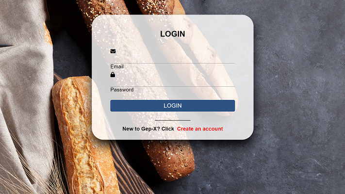
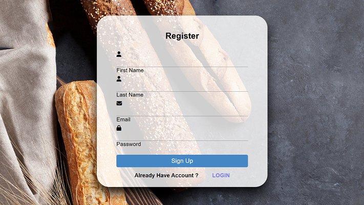
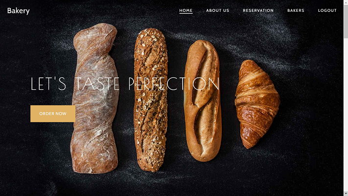

# Bakery Website with Authentication and Database Connection  

This project is a **bakery website** that integrates **user authentication** and **data management** functionalities using **PHP and MySQL**. The responsive frontend is developed with **HTML, CSS, Bootstrap, and JavaScript**, showcasing proficiency in **web development**.

---

## Key Features  
1. **User Authentication**: Secure login and signup functionality.  
2. **Data Management**: Store and manage user data efficiently in the database.  
3. **Responsive Frontend Interfaces**: Adaptable design using Bootstrap for all devices.  
4. **Proficiency in PHP and MySQL**: Backend functionality for dynamic operations.  
5. **Web Development Skills**: Hands-on experience with modern web development tools.

---

## Screenshots  

**Login Page**  
  

**Signup Page**  
  

**Bakery Website UI**  
  

---

## Installation and Setup  

To run the project locally, follow these steps:

1. **Clone the Repository**:  
   ```bash
   git clone <repository-url>
